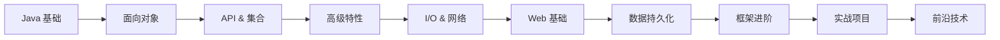

# Java Web 开发知识库

> 🎯 这是一个完整的 Java Web 开发知识体系，从 Java 基础到框架实战，按学习路径组织。

---

## 📖 学习路线图

---

## 📘 一、Java 基础 (Javase)

### 1.1 面向对象基础

| 笔记 | 核心内容 |
|------|----------|
| [[Java/Javase/类的基本语法\|类的基本语法]] | 构造器、`this`、封装、JavaBean、`static` |
| [[Java/Javase/继承\|继承]] | `extends`、权限修饰符、方法重写、`super` |
| [[Java/Javase/多态\|多态]] | 多态前提、类型转换、`instanceof` |

### 1.2 面向对象高级

| 笔记 | 核心内容 |
|------|----------|
| [[Java/Javase/面向对象高级1\|面向对象高级1]] | `final`、单例模式、枚举、抽象类、接口 |
| [[Java/Javase/面向对象高级2\|面向对象高级2]] | 代码块、内部类、匿名内部类、Lambda、方法引用 |

### 1.3 常用 API

| 笔记 | 核心内容 |
|------|----------|
| [[Java/Javase/常用的API\|常用的API]] | Math、System、Object、String、Date、BigDecimal |
| [[Java/Javase/API(正则表达式)\|正则表达式]] | 字符类、预定义字符、数量词 |

### 1.4 集合框架

| 笔记 | 核心内容 |
|------|----------|
| [[Java/Javase/Java加强02——集合框架\|集合框架]] | Collection、List、Set、Map、Stream、Collections |

---

## 📙 二、高级特性

| 笔记 | 核心内容 |
|------|----------|
| [[Java/Javase/Java加强01\|Java加强01]] | 异常处理 (`try-catch`/`throws`)、泛型、包装类 |
| [[Java/Javase/反射\|反射]] | `Class`、`Constructor`、`Field`、`Method` |
| [[Java/Javase/动态代理\|动态代理]] | `Proxy.newProxyInstance()`、`InvocationHandler` |
| [[Java/Javase/多线程&JUC\|多线程 & JUC]] | Thread、Runnable、Callable、线程池、锁、JUC |

---

## 📕 三、I/O 与网络

| 笔记 | 核心内容 |
|------|----------|
| [[Java/Javase/存储&读写数据的方案\|存储 & 读写数据]] | File、字节流、字符流、缓冲流、序列化 |
| [[Java/Javase/网络编程\|网络编程]] | TCP/UDP、Socket、三次握手/四次挥手 |

---

## 🌐 四、Web 基础

| 笔记 | 核心内容 |
|------|----------|
| [[Java/Javaweb/Web基础\|Web 基础]] | SpringBoot 入门、HTTP 协议、三层架构、IOC & DI |

### 关键概念速查

- **IOC**（控制反转）：对象的创建权交给 Spring 容器 → `@Component` / `@Controller` / `@Service` / `@Repository`
- **DI**（依赖注入）：容器自动注入依赖 → `@Autowired`、构造函数注入（推荐）
- **三层架构**：Controller（控制层）→ Service（业务层）→ Dao（持久层）

---

## 🗄️ 五、数据持久化

| 笔记 | 核心内容 |
|------|----------|
| [[Java/Javaweb/MySQL\|MySQL]] | DDL/DML/DQL、多表关系、多表查询、事务 |
| [[Java/Javaweb/Mybatis\|Mybatis]] | CRUD 注解/XML、动态 SQL、`#{}` vs `${}` |

> **链路**：MySQL 建表 → Mybatis Mapper 接口 → SpringBoot Service → Controller 响应

---

## 🔧 六、中间件与工具

| 笔记 | 核心内容 |
|------|----------|
| [[Java/Javaweb/Maven\|Maven]] | 依赖管理、坐标、生命周期、JUnit 单元测试 |
| [[Java/Javaweb/Maven高级\|Maven 高级]] | 分模块设计、继承与聚合、版本锁定、私服 |
| [[Java/Javaweb/Linux\|Linux]] | 常用命令、vim、软件安装、JDK 部署 |

---

## 🚀 七、框架进阶

| 笔记 | 核心内容 |
|------|----------|
| [[Java/Javaweb/SpringBoot配置文件\|SpringBoot 配置]] | yml 格式、对象/数组配置 |
| [[Java/Javaweb/Spring AOP\|Spring AOP]] | 通知类型、切入点表达式、`@Around`、ThreadLocal |
| [[Java/Javaweb/SpringBoot原理\|SpringBoot 原理]] | 配置优先级、Bean 作用域 |

### AOP 核心概念

| 概念 | 说明 |
|------|------|
| 连接点 JoinPoint | 可以被 AOP 控制的方法 |
| 通知 Advice | 重复逻辑（共性功能） |
| 切入点 PointCut | 匹配连接点的条件 |
| 切面 Aspect | 通知 + 切入点 |
| 目标对象 Target | 通知所应用的对象 |

---

## 🎯 八、实战项目

| 笔记 | 核心内容 |
|------|----------|
| [[Java/Javaweb/Web后端实战\|Web 后端实战]] | Tlias 智能学习系统：部门/员工管理、Restful、文件上传、登录认证 |

---

## 🤖 九、前沿技术

| 笔记 | 核心内容 |
|------|----------|
| [[Java/Java AI/Spring AI\|Spring AI]] | ChatClient、RAG、Agent、Function Call、Fine-tuning |

---

## 📊 十、数据结构与算法

| 笔记 | 核心内容 |
|------|----------|
| [[数据结构与算法（Java）/时间复杂度\|时间复杂度]] | O(1) / O(n) / O(n²) / O(log n) 速判口诀 |

---

## 🏷️ 标签总览

| 标签 | 含义 |
|------|------|
| `#java/basic` | Java 基础语法 |
| `#java/oop` | 面向对象 |
| `#java/api` | API 与工具类 |
| `#java/collection` | 集合框架 |
| `#java/advanced` | 高级特性（反射、代理、泛型） |
| `#java/concurrency` | 多线程并发 |
| `#java/io` | I/O 与网络 |
| `#web/springboot` | SpringBoot |
| `#web/mysql` | MySQL 数据库 |
| `#web/mybatis` | Mybatis 持久层 |
| `#web/maven` | Maven 构建 |
| `#web/linux` | Linux 运维 |
| `#ai/spring-ai` | Spring AI |
| `#algorithm` | 数据结构与算法 |

---

> 💡 **使用建议**：从「Java 基础」开始按顺序学习，每个模块学完后再进入下一个。实战项目建议在学完 Mybatis 和 Spring AOP 后再做。
