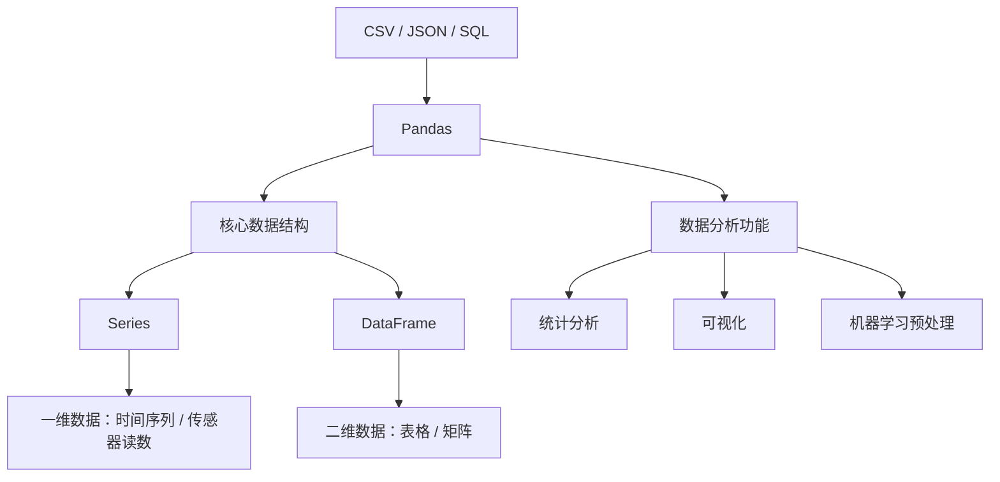

# Pandas

## 简介

+ Pandas 是 Python 数据分析工具链中最核心的库，充当数据读取、清洗、分析、统计、输出的高效工具。

+ Pandas 提供了易于使用的数据结构和分析工具，特别适用于处理结构化数据，如表格型数据（类似于 Excel 表格）。

+ Pandas 是数据科学和分析领域中常用的工具之一，它使得用户能够轻松地从各种数据源中导入数据，并对数据进行高效的操作和分析。

+ Pandas 是基于 NumPy 构建的专门为处理表格和混杂数据设计的 Python 库，核心设计理念包括：

  - 标签化数据结构：提供带标签的轴
  - 灵活处理缺失数据：内置 NaN 处理机制
  - 智能数据对齐：自动按标签对齐数据
  - 强大 IO 工具：支持从 CSV、Excel、SQL 等 20+ 数据源读写
  - 时间序列处理：原生支持日期时间处理和频率转换



| 特性     | Series             | DataFrame                     |
| :------- | :----------------- | :---------------------------- |
| 维度     | 一维               | 二维                          |
| 索引     | 单索引             | 行索引 + 列名                 |
| 数据存储 | 同质化数据类型     | 各列可不同数据类型            |
| 类比     | Excel 单列         | 整张 Excel 工作表             |
| 创建方式 | pd.Series([1,2,3]) | pd.DataFrame({'col':[1,2,3]}) |

## Series

### Series的创建

```python
# series的创建
import pandas as pd
s = pd.Series([1,2,3,4,5])
print(s)
# 自定义索引
s = pd.Series([1,2,3,4,5], index=['a','b','c','d','e'])
#print(s)
# 定义name
s = pd.Series([1,2,3,4,5], index=['a','b','c','d','e'], name='月份')
print(s)
# 通过字典来创建
s = pd.Series({'a':1,'b':2,'c':3,'d':4,'e':5})
print(s)
s1 = pd.Series(s, index=['a','c'])
print(s1)
```

### Series的属性

| 属性           | 说明              | 属性   | 说明                       |
| :------------- | :---------------- | :----- | :------------------------- |
| index          | Series 的索引对象 | loc[]  | 显式索引，按标签索引或切片 |
| values         | Series 的值       | iloc[] | 隐式索引，按位置索引或切片 |
| dtype / dtypes | Series 的元素类型 | at[]   | 使用标签访问单个元素       |
| shape          | Series 的形状     | iat[]  | 使用位置访问单个元素       |
| ndim           | Series 的维度     |        |                            |
| size           | Series 的元素个数 |        |                            |
| name           | Series 的名称     |        |                            |

### Series的常用方法

| 方法                | 说明                                                      |
| :------------------ | :-------------------------------------------------------- |
| head(n)             | 查看前 n 行数据，默认 5 行                                |
| tail(n)             | 查看后 n 行数据，默认 5 行                                |
| isin(values)        | 判断元素是否包含在参数集合中                              |
| isna() / isnull()   | 判断是否为缺失值（NaN 或 None）                           |
| notna() / notnull() | 判断是否为非缺失值                                        |
| sum()               | 求和，自动忽略缺失值                                      |
| mean()              | 平均值                                                    |
| min()               | 最小值                                                    |
| max()               | 最大值                                                    |
| var()               | 方差                                                      |
| std()               | 标准差                                                    |
| median()            | 中位数                                                    |
| mode()              | 众数（可返回多个）                                        |
| quantile(q)         | 分位数，q 取 0~1 之间                                     |
| describe()          | 常见统计信息（count、mean、std、min、25%、50%、75%、max） |
| value_counts()      | 每个唯一值的出现次数                                      |
| count()             | 非缺失值数量                                              |
| unique()            | 获取去重后的值数组                                        |
| nunique()           | 唯一值个数（去重）                                        |
| drop_duplicates()   | 去除重复项                                                |
| sample(n)           | 随机抽样                                                  |
| sort_index()        | 按索引排序                                                |
| sort_values()       | 按值排序                                                  |
| replace(old, new)   | 替换值                                                    |
| keys()              | 返回 Series 的索引对象                                    |

## DataFrame

### DateFrame的创建

```python
# dataframe的创建方式
import pandas as pd
import numpy as np
# 通过series创建
s1 = pd.Series([1,2,3,4,5])
s2 = pd.Series([6,7,8,9,10])
df = pd.DataFrame({"第1列":s1,"第2列":s2})
df
# 通过字典来创建
df = pd.DataFrame(
    {
        "name":["张三","李四","王五","赵六","钱七"],
        "age":[18,19,20,21,22],
        "score":[60,70,80,90,100]
    },index=[1,2,3,4,5],columns=["name","score","age"] # 指定列的顺序
)
df
```

### DataFrame属性

| 属性    | 说明                 | 属性   | 说明                           |
| :------ | :------------------- | :----- | :----------------------------- |
| index   | DataFrame 的行索引   | loc[]  | 显式索引，按行列标签索引或切片 |
| values  | DataFrame 的值       | iloc[] | 隐式索引，按行列位置索引或切片 |
| dtype   | DataFrame 的元素类型 | at[]   | 使用行列标签访问单个元素       |
| shape   | DataFrame 的形状     | iat[]  | 使用行列位置访问单个元素       |
| ndim    | DataFrame 的维度     | T      | 行列转置                       |
| size    | DataFrame 的元素个数 |        |                                |
| columns | DataFrame 的列标签   |        |                                |

### DataFrame常用方法

| 方法              | 说明                               | 方法          | 说明                                                      |
| :---------------- | :--------------------------------- | :------------ | :-------------------------------------------------------- |
| head()            | 查看前 n 行数据，默认 5 行         | max()         | 最大值                                                    |
| tail()            | 查看后 n 行数据，默认 5 行         | var()         | 方差                                                      |
| isin()            | 判断元素是否包含在参数集合中       | std()         | 标准差                                                    |
| isna()            | 判断是否为缺失值（如 NaN 或 None） | median()      | 中位数                                                    |
| sum()             | 求和，自动忽略缺失值               | mode()        | 众数（可返回多个）                                        |
| mean()            | 平均值                             | quantile(q)   | 分位数，q 取 0~1 之间                                     |
| min()             | 最小值                             | describe()    | 常见统计信息（count、mean、std、min、25%、50%、75%、max） |
| value_counts()    | 每个唯一值的出现次数               | sort_values() | 按值排序                                                  |
| count()           | 非缺失值数量                       | replace()     | 替换值                                                    |
| duplicated()      | 是否重复                           | nlargest()    | 返回某列最大的 n 条数据                                   |
| drop_duplicates() | 去除重复项                         | nsmallest()   | 返回某列最小的 n 条数据                                   |
| sample()          | 随机抽样                           |               |                                                           |
| sort_index()      | 按索引排序                         |               |                                                           |
